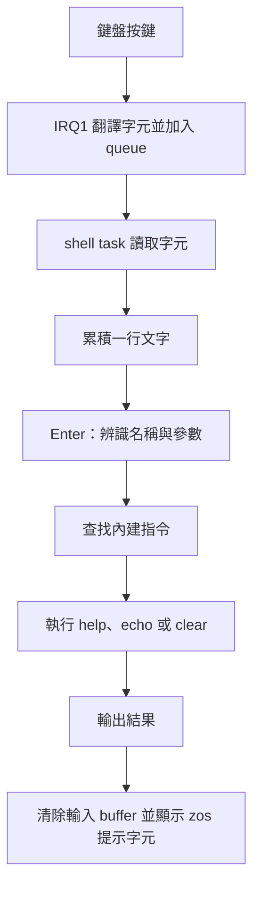

# ZOS 基本 shell 指令計畫與新手背景

日期：2026-10-03。狀態：規劃，尚未實作。
本計畫以目前工作目錄為基準。能力盤點見[指令適配調查](shell-command-readiness.md)。
第一階段保留 `clear`，加入 `help` 與 `echo`。`uname` 與 `uptime` 排在後續階段。
本文的命令列規則是 ZOS 第一版設計，不表示完整 Bash、GNU 或 POSIX 相容。

## 先理解指令、shell 與核心

你輸入的 `echo hello` 是文字。
Shell 負責讀取這段文字、找出指令名稱，再呼叫對應功能。
可以把 shell 想成櫃台，指令是你指定的工作，核心提供執行工作所需的硬體與資源服務。
在目前 ZOS 中，櫃台與工作函式都編譯在核心裡，並由同一個 shell task 執行。
[目前 shell](../kernel/shell.zc)、[shell task 建立](../kernel/kernel.zc)

一般 Unix/Linux shell 有內建指令與外部程式兩種執行方式。
內建指令由 shell 自己執行。外部程式則由 shell 找到可執行檔，再啟動或交接執行。
Bash 的 `help` 是內建指令，`echo` 也有內建與 GNU 外部程式版本。
這些名稱可以出現在不同作業系統，不是 Linux 核心專用的文字語法。
[Bash 執行模型](https://www.gnu.org/software/bash/manual/html_node/Command-Search-and-Execution.html)、
[Bash help](https://www.gnu.org/software/bash/manual/html_node/Bash-Builtins.html)、
[GNU echo](https://www.gnu.org/software/coreutils/manual/html_node/echo-invocation.html)

ZOS 第一階段採用內建指令。
你需要新增 Zenc 函式，以及「文字名稱對應函式」的分派邏輯。
編譯器將這些函式轉成 C，再由工具鏈產生核心機器碼。
輸入指令時，shell 呼叫已編譯的函式，不會現場編譯命令文字。
[編譯流程](../Makefile)、[目前 clear 分派](../kernel/shell.zc)

## 從按鍵到指令結果



IRQ 是硬體事件通知核心的入口。Queue 是暫存字元的佇列。
Task 是一條可等待、恢復執行的核心流程。
目前 IRQ1 只處理輸入與通知，shell task 負責文字處理與畫面輸出。
第一階段沿用這個分工。[鍵盤 IRQ](../kernel/keyboard.zc)、[shell task](../kernel/shell.zc)

螢幕上有兩種容易混淆的文字輸出：

1. 輸入回顯：打字時，shell 顯示你正在輸入的字元。
2. 指令結果：按下 Enter 後，`echo` 再輸出參數文字。

例如，下列畫面是第一階段完成後的預期行為：

```text
zos> echo hello zos
hello zos
zos>
```

第一行由輸入回顯產生。第二行由 `echo` 的指令函式產生。
目前只有第一種回顯與 `clear`，尚未有 `echo` 指令。
[shell_feed_char](../kernel/shell.zc)

## 第一階段的使用者行為

| 輸入 | 預期指令結果 |
| --- | --- |
| `help` | 列出 `clear`、`help`、`echo` 的名稱與用法。 |
| `help echo` | 顯示 `echo` 的用法、換行與文字解析限制。 |
| `help clear` | 顯示 `clear` 的用法。 |
| `help help` | 顯示 `help` 的用法。 |
| `help missing` | 顯示 `help: unknown command`。 |
| `help echo clear` | 顯示 `usage: help [command]`。 |
| `echo hello zos` | 輸出 `hello zos`，最後加一次換行。 |
| `echo` | 只輸出一次換行。 |
| `echo   hello   zos  ` | 輸出 `hello zos`，最後加一次換行。 |
| `clear` | 清除 VGA 畫面，再顯示提示字元。 |
| `clear extra` | 顯示 `usage: clear`，不執行清除。 |
| `echoes`、`helpful`、`clearly` | 顯示既有的 `unknown command`。 |
| 空行或只有空白 | 不輸出錯誤，回到提示字元。 |

VGA 第一版維持現有字元能力，指令說明使用 ASCII 英文，教學文件使用繁體中文。
建議共用下列指令資料：

| 名稱 | 用法 | 簡短說明 |
| --- | --- | --- |
| `clear` | `clear` | `Clear the screen.` |
| `help` | `help [command]` | `Show command help.` |
| `echo` | `echo [text ...]` | `Print text and a newline.` |

`help echo` 另顯示 `Use spaces to separate words.` 與 `Quotes and options are literal text.`。
不要為這兩個指令另外加入中文字型或 UTF-8 終端機支援。
[目前字元輸入與輸出](../kernel/shell.zc)、[VGA cell 寫入](../kernel/console.zc)

GNU `echo` 的基本用途是將參數以空白隔開輸出，最後加換行。
ZOS 先實作這部分，再逐步加入其他語法。
[GNU echo](https://www.gnu.org/software/coreutils/manual/html_node/echo-invocation.html)

## 第一版命令列規則

- 指令名稱區分大小寫，必須完整匹配。
- ASCII 空白是第一版唯一的參數分隔字元。
- 忽略指令之前的空白，略過參數之間重複的空白。
- `help` 接受零個或一個參數，`clear` 接受零個參數。
- `echo` 接受任意數目的文字詞，但受整行 4095 字元容量限制。
- `echo` 將詞以一個空白連接，最後輸出換行。
- 引號、反斜線、變數符號、pipe 與重導向符號都先當成普通文字。
- `echo` 第一版不辨識選項。`-n`、`-e` 等文字不改變輸出規則。
- 空白不建立空參數。第一版沒有 Bash 的空字串參數語法。
- 沿用 Enter／CR、Backspace、可列印 ASCII 與超出 buffer 容量時忽略新字元的既有行為。

例如，若直接向 `shell_feed_char()` 傳入 `echo -n hello`，預期結果是 `-n hello` 與換行。
若傳入 `echo "hello world"`，引號會保留在輸出中。
這些例子用於說明第一版解析規則，目前 PS/2 輸入路徑尚不能產生其中所有符號。
Bash 的引號具有控制字元與參數分組語意，屬於後續獨立的解析功能。
[Bash 引號](https://www.gnu.org/software/bash/manual/html_node/Quoting.html)

目前 `shell_feed_char()` 接受可列印 ASCII，但 PS/2 翻譯器只支援字母、數字、部分 Shift 符號、空白與編輯按鍵。
引號、反斜線與 `-` 尚未列入鍵盤翻譯。
第一階段的主要互動例子只使用現有鍵盤可輸入的字元。
符號邊界由主機 harness 直接餵入 shell 驗證，避免把 shell 能處理誤認為鍵盤能輸入。
[ASCII 接收](../kernel/shell.zc)、[PS/2 翻譯](../kernel/keyboard.zc)

## 實作責任與記憶體界線

先保留程式碼在 `kernel/shell.zc`，依責任分成小函式。
目前只有三個內建指令，尚不需要新增外部程式模組或載入器。

| 責任 | 應做的工作 |
| --- | --- |
| 輸入處理 | 保存既有字元回顯、Backspace、Enter 與 buffer 重設。 |
| 詞掃描 | 用 start／end 索引取得指令名稱或下一個參數詞。 |
| 指令查找 | 以名稱與長度匹配，回傳內部 command ID。 |
| 指令資料 | 集中管理名稱、用法與說明，供查找和 `help` 共用。 |
| 參數檢查 | 檢查 `help`、`clear` 的參數數目。 |
| 指令執行 | 個別執行清除、顯示說明或文字輸出。 |

`echo hello zos` 可以概念上拆成 `echo`、`hello`、`zos` 三個詞。
一般外部程式常以 `argc` 表示參數數量，`argv` 表示參數字串陣列。
ZOS 目前可用索引逐詞掃描同一個 buffer，不必先配置完整 `argv` 陣列。
索引表示某段資料位於 buffer 的哪個範圍，避免複製整行文字。
[Linux execve 的 argv](https://man7.org/linux/man-pages/man2/execve.2.html)

每次讀取前，檢查索引小於 `_shell_length`。
文字片段使用起點與長度輸出，避免誤將整段後續參數一起輸出。
完成指令後才重設 buffer，片段引用不保留到下一次輸入。
指令描述表的具體 Zenc 表示法可在實作時選定，無須先增加函式指標框架。

現有指令 buffer 是 4096-byte 全域陣列，末尾保留一個零字元。
Shell task 的 stack 是 4 KiB。
第一版使用少量索引與狀態，不在 stack 上建立另一份 4096-byte 複本。
沿用 freestanding 編譯，不引入 `malloc`、`printf`、`strtok` 或其他 hosted libc 依賴。
[Shell buffer](../kernel/shell.zc)、[Task stack](../kernel/task.zc)、[既有物件檢查](../tests/shell_static.sh)

## 分段實作任務

### 任務 1：讓 clear 使用有界名稱與參數解析

將目前整行比較改為詞掃描與完整名稱查找，先完成 `clear` 的完整路徑。
先新增對應的行為測試，再修改 shell。

驗收：

- [ ] `clear`、前後有空白的 `clear` 都能清除畫面，`clear extra` 只顯示用法。
- [ ] 空白行沒有錯誤，名稱前綴不誤匹配，索引不超出已接受的輸入長度。
- [ ] 原有 Backspace、長輸入、未知指令、提示字元與 shell 阻塞行為通過。

驗證：`make test-shell`、`make test-shell-task`。
相依：無。
預計檔案：`kernel/shell.zc`、`tests/shell_static.sh`、`docs/shell-contract.md`。
範圍：小型行為變更，三個檔案。

### 任務 2：加入 help 與共用指令資料

加入 `help` 的查找、用法與說明。Help 清單只列當時已實作的指令。
這一步尚未實作 `echo`，因此先列 `clear` 與 `help`。

驗收：

- [ ] `help` 列出實際支援的指令，`help clear` 與 `help help` 取得同一份指令資料。
- [ ] 未知目標顯示 `help: unknown command`，多餘參數顯示用法，下一個提示字元正常。
- [ ] 移除「help 必須未知」的舊預期，保留真正未知指令的測試。

驗證：`make test-shell`、`make test-shell-task`。
相依：任務 1。
預計檔案：`kernel/shell.zc`、`tests/shell_static.sh`、`docs/shell-contract.md`。
範圍：小型指令擴充，三個檔案。

檢查點：任務 1、2 完成後執行 `make test`。

### 任務 3：加入 echo 的文字輸出

沿用同一個詞掃描規則，逐詞輸出 `echo` 的參數。
加入 `echo` 的指令資料，讓 `help` 自動反映新增能力。

驗收：

- [ ] 一個或多個詞正確輸出，詞之間一個空白，末尾一次換行；無參數也輸出換行。
- [ ] 驗證多餘空白、一般符號、接近 4095 字元容量與下一次命令，資料不串到下一行。
- [ ] `help echo` 顯示限制，輸入回顯與指令結果可分別辨識，物件沒有 hosted libc 符號。

驗證：`make test-shell`、`make test-shell-task`。
相依：任務 1、2。
預計檔案：`kernel/shell.zc`、`tests/shell_static.sh`、`docs/shell-contract.md`。
範圍：小型指令擴充，三個檔案。

### 任務 4：驗證真實鍵盤路徑與更新使用說明

在既有 QEMU 鍵盤流程加入 `help`、`help echo` 與 `echo hello zos`，保留原有事件等待回歸。
輸入使用已支援的 PS/2 字元，將畫面與狀態證據留在測試輸出目錄。

驗收：

- [ ] QEMU 真實 IRQ 輸入可完成三個例子，VGA 顯示結果及下一個提示字元。
- [ ] 未知指令、Backspace、`clear`、無輸入時 shell 阻塞，以及 PIT tick 都維持正常。
- [ ] README 與 shell 契約列出已完成指令與解析限制，完整回歸通過。

驗證：`make test`，再執行 `make test-event-wait-qemu EVENT_WAIT_OPT=-O2 EVENT_WAIT_BOOT=iso`。
相依：任務 2、3。
預計檔案：`tests/event_wait_qemu.py`、`README.md`、`docs/shell-task-contract.md`。
範圍：整合驗證與文件，三個檔案。
`tests/task_lifecycle_qemu.py` 重用該輸入流程，新增案例不能破壞它的預期。

最終檢查點：上述驗收與 `git diff --check` 通過後，整理實作及驗證結果。
本次僅建立計畫，因此以上實作驗收仍未勾選。

## 接下來如何增加其他指令

| 後續階段 | 最小能力 | 可學到的 OS 概念 |
| --- | --- | --- |
| `uname` | 先輸出 `ZOS`；選項版先補 `-` 等鍵盤字元 | 指令介面與真實系統識別資料的關係 |
| `uptime` | 讀 PIT ticks 並轉成近似時間，定義計時起點與回繞處理 | 中斷計數、時間單位、整數溢位 |
| `tasks`、`heap` | 新增一致的查詢 API，再格式化輸出 | 核心狀態快照、資源統計、模組邊界 |
| 引號與跳脫 | 新增解析狀態，搭配鍵盤字元支援 | 字元與語法的區別、參數分組 |
| `ls`、`cd`、`pwd`、`cat` | 最小 RAM 檔案系統、路徑與讀取介面 | 目錄、檔案、目前工作目錄、EOF |
| 外部程式 | 定義程式格式、載入器、程序與參數入口 | 程式映像、程序生命週期、使用者執行環境 |

目前 PIT 已設定成約 100 Hz。`help` 與 `echo` 不需要 timer 功能。
之後 `uptime` 可以讀取現有 tick；`sleep` 則需要另外加入到期條件與 task 喚醒。
這兩種需求可以沿用同一個 PIT，但需要不同的核心服務。
[PIT 設定與 IRQ](../kernel/timer.zc)、[task 等待與喚醒](../kernel/task.zc)

## 長期背景：標準輸出與 system call

在常見 Linux 執行模型中，使用者程式透過 system call 請核心處理 I/O。
`write` 會把 buffer 的資料寫到指定 file descriptor 所代表的輸出目標。
File descriptor 是核心交給程序的整數識別值，可以指向檔案、終端機或 pipe。
[Linux write](https://man7.org/linux/man-pages/man2/write.2.html)

GNU `echo` 將結果寫到標準輸出。
若 shell 設定重導向，標準輸出可以連到檔案或 pipe。
ZOS 第一版直接呼叫 `console_putc()` 或 `console_write()`，輸出到 VGA。
它尚未建立可以重導向的標準輸出模型。
[GNU echo](https://www.gnu.org/software/coreutils/manual/html_node/echo-invocation.html)、[ZOS console](../kernel/console.zc)

`execve` 將目前程序的程式映像替換成指定程式，本身不建立新程序。
Shell 可以先建立子程序，再由子程序載入外部程式，並收取結束狀態。
若未來要像 Linux 執行受保護的使用者程式，還需要使用者記憶體、Ring 3 與受控的核心入口。
這些是後續 OS 里程碑，第一階段的內建指令可以先建立可用的命令介面。
[Linux execve](https://man7.org/linux/man-pages/man2/execve.2.html)、
[Bash 執行模型](https://www.gnu.org/software/bash/manual/html_node/Command-Search-and-Execution.html)、
[目前核心範圍](../README.md)

## 學習與閱讀順序

1. 閱讀 `shell_feed_char()`，理解字元如何累積成一行。
2. 閱讀 `_shell_execute()`，理解名稱如何選出功能。
3. 閱讀 `console_putc()`，理解字元如何顯示到 VGA。
4. 閱讀 `tests/shell_static.sh`，理解如何用 console stub 在主機檢查指令結果。
5. 查看 QEMU 輸入測試，理解主機函式測試與真實硬體路徑驗證的差別。

來源：[shell.zc](../kernel/shell.zc)、[console.zc](../kernel/console.zc)、
[shell harness](../tests/shell_static.sh)、[QEMU 輸入驗證](../tests/event_wait_qemu.py)。
