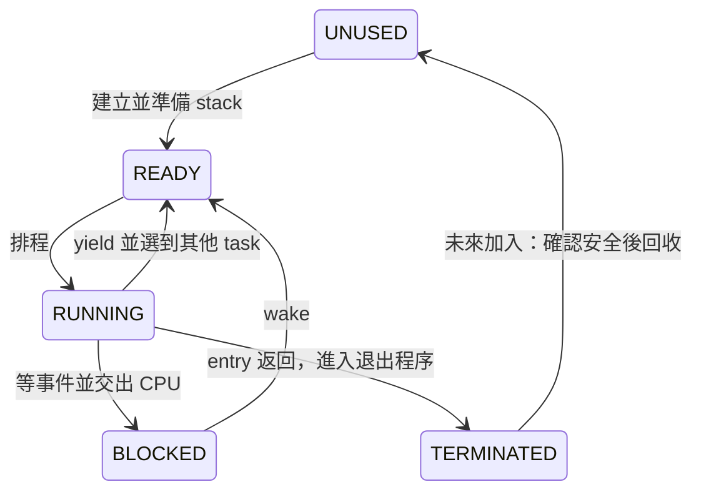

# Task 生命週期：從停止執行到安全重用

調查日期：2026-10-02。對照調查時的工作區，包含已完成的事件等待變更。這份筆記先補齊理解 ZOS 下一個里程碑所需的概念；「目前行為」來自本專案程式碼，「設計選項」保留調查時的比較。

後續訪談已確認[生命週期設計](task-lifecycle-plan.md)，包含自動回收、世代 Task ID 與世代用盡政策。

最先記住兩件事：**task 的工作結束後，核心還需要執行退出程序；舊 stack 可以重新初始化之前，也必須確認 CPU 已離開它。** 因此，生命週期管理既要決定「誰還能執行」，也要決定「誰還在使用資源」。

## 1. 現在 ZOS 已經有什麼？

目前 task table 有四格。Task 0 是開機執行環境，沿用 boot stack；slot 1 至 3 各配一個靜態 4 KiB stack。新 task 在 Ring 0 執行，主動 yield、block 或 exit 才交出 CPU；timer IRQ 沒有搶佔排程。這些 task 適合理解為核心執行緒。[ZOS task 規格](task-contract.md)、[task 實作](../kernel/task.zc)

`task_create()` 使用 `_task_next_id` 依序配置 1、2、3，到 4 就拒絕建立；已終止的格子仍保留 `TERMINATED`。`task_count()` 是包含 task 0 的累計成功建立數，退出時不減少。因此目前限制是整次開機只能新建三個 task。這個里程碑要學會的，是讓有限的格子服務更多次建立與退出。[task_create、task_count、_task_exit](../kernel/task.zc)

例如 boot 在 slot 0、shell 在 slot 1；A 使用 slot 2 後退出，B 使用 slot 3 後退出。接著建立 C 仍失敗，儘管 A、B 都不再執行。**同時只有四格容量**，與**整次開機只准新建三次**，是不同限制。

## 2. Process、thread、task 差在哪裡？

一般模型中，process（行程）提供程式的位址空間與資源範圍；thread（執行緒）是其中一條執行流程。同一 process 的 threads 共用位址空間，各自保存暫存器與 stack。[OSTEP 作者教材，第 26 章](https://pages.cs.wisc.edu/~remzi/OSTEP/threads-intro.pdf)

套到這個專案，可先用下表閱讀程式：

| 名詞 | 在目前 ZOS 中的意思 |
| --- | --- |
| Task | 排程器管理的一條核心執行流程；目前沒有自己的 user space 或 page table。 |
| Context（執行上下文） | 足以讓這條流程之後接續執行的 CPU 狀態。 |
| Stack（堆疊） | 呼叫函式、保存返回位址、暫存資料及保存 context 的記憶體。 |
| Slot（欄位） | Task table 的一格，連同對應的靜態 stack 名額。 |
| ID／handle（識別值） | 呼叫者拿來查詢 task 的值；目前數字直接等於 slot。 |

這張表是對 [ZOS 的資料結構與 ABI](../kernel/task.zc)的整理。特別注意：**一格 slot 是容器，一次 task 生命週期是容器中的某個使用者。** 加入重用後，兩者不一定還能用同一個數字表示。

可以把 task 想成「一份可以暫停、之後從原處繼續的工作」。暫存器是 CPU 內的小型儲存位置；stack 保存呼叫進度和部分區域資料。ZOS 的各個 task 共用核心記憶體，各自有自己的執行進度，因此建立 task 比一般函式呼叫多了「交給排程器管理」這一步。[ZOS 建立與切換](../kernel/task.zc)、[stack 保存格式](../arch/i686/tasks.S)

## 3. 狀態描述的是「還能不能執行」

現有狀態可這樣讀：`UNUSED` 尚未分配、`READY` 等 CPU、`RUNNING` 正在跑、`BLOCKED` 等事件、`TERMINATED` 已退出且不再排程。[狀態與轉換](../kernel/task.zc)



最後一條箭頭是待設計的行為。`BLOCKED` 的 task 仍然活著，醒來必須接著原來的呼叫繼續執行；回收它會破壞尚未完成的工作。`TERMINATED` 則表示不該再恢復執行，但**單看這個狀態，還無法證明退出程式已離開它的 stack**。

## 4. 為什麼保存 ESP 就能接著跑？

ESP 是 i686 的 stack pointer，指出目前 stack 的位置。EFLAGS 保存 CPU 的旗標，其中 IF 控制一般可遮罩硬體中斷是否開啟。ZOS 切換時先把 EFLAGS 與通用暫存器推入舊 stack，再記下 ESP；接著載入另一個 task 保存的 ESP，從新 stack 還原資料，最後 `ret`（從 stack 取出返回位址並跳轉）。[i686 context switch](../arch/i686/tasks.S)、[IF 保存與還原](../arch/i686/interrupts.S)

```text
舊 stack：保存暫存器、EFLAGS、返回位址 → 記下舊 ESP
                                   ↓ 改寫 CPU 的 ESP
新 stack：還原暫存器、EFLAGS、返回位址 → 接續新 task
```

所以 `_zos_task_context_switch()` 的「返回」有特殊意思：CPU 讀的是被恢復 task 的返回位址。A 呼叫切換後，可能先由 B 接著跑；等 A 再被選中，才會像函式返回一樣繼續 A 的程式。[切換組語](../arch/i686/tasks.S)

新建 task 尚未跑過，也能使用同一套機制：`_zos_task_prepare_stack()` 人工排出符合還原格式的初始 frame，把 entry 位址放到第一次 `ret` 會讀的位置，並安排 entry 返回後進入 exit trampoline（退出轉接程式）。目前還原的範圍是通用暫存器與 EFLAGS；規格尚未包含 FPU／SSE context。[初始 frame 與 trampoline](../arch/i686/tasks.S)、[ABI 範圍](task-contract.md)

## 5. 終止與回收為什麼要分開？

IRQ 是硬體中斷。ZOS 目前用關閉一般可遮罩 IRQ 的方式，保護 task table 更新與切換的短暫過渡區間；這段稱為臨界區。沿著目前退出路徑看：

1. Entry 函式返回，進入組語 trampoline。
2. Trampoline 呼叫 `_task_exit()`；此時仍使用退出 task 的 stack。
3. `_task_exit()` 關閉 IRQ、清掉 wait channel，寫入 `TERMINATED`。
4. 排程器選擇下一個 task，更新 `_task_current_id`。
5. 組語保存舊 context，**實際改寫 ESP**，才離開舊 stack。

這些步驟來自 [退出與排程程式](../kernel/task.zc)及[切換組語](../arch/i686/tasks.S)。回收判斷要覆蓋第 5 步；第 3 步的狀態與第 4 步的 current ID 都比真正切換早。

假設未來加入重用時，A 剛把自己標成 `TERMINATED`，就讓 `task_create(B)` 覆寫 A 的 stack。A 的退出程序還在那裡執行，函式返回位址或剛保存的暫存器便可能被 B 的初始 frame 蓋掉。即使記憶體從未 `free()`，仍會發生生命週期錯誤。現有版本沒有重用，因此這是新設計必須防止的情況。

另一個細節是：切換組語在改寫 ESP 前，還會把舊 ESP 寫回 `old_sp`。提前清空舊 `_task_saved_sp`，可能又被這次保存覆寫。這說明安全回收需要一個明確的「切換完成後」位置，而不只是多寫一個狀態。[old_sp 的最後寫入](../arch/i686/tasks.S)

目前 stack 是固定陣列；「回收」的意思是解除舊 task 對那格的占用，使下一個 task 可以重建初始 frame。它不會減少核心占用的 RAM，也不需要導入 heap 的 `free()`。[靜態 stack 配置](../kernel/task.zc)

建議先採取容易證明的順序：切換完成後，再發布 slot 可用。若嚴格保證過渡期間沒有其他配置者，某些 metadata 也能提前更新；真正不可提前的，是覆寫仍在使用的 stack。重建新 task 必要的 frame，也不等於必須把整個 4 KiB 清成零；清零需求可以另外定義。

還有一條要納入設計的路徑：新 task 第一次被選中時，會直接進入 entry，沒有先前的 `yield()` 呼叫可以返回。因此不能假定「在某次 C 切換呼叫後加上清理」就涵蓋每次切換；首次啟動也要有能完成交接的安排。[新 stack 的 entry 位址](../arch/i686/tasks.S)

以上是從 ZOS 程式碼推導的設計要求。若將來 task 把 stack 上的區域資料位址交給其他 task 或 IRQ 使用，離開舊 stack 後，還要確保那些使用者也停止存取，才可重用那塊空間。

## 6. 其他核心如何安排這件事？

MIT 的 x86 xv6 把退出中的 process 標成 `ZOMBIE`，再切到 scheduler。父行程的 `wait()` 之後釋放 kernel stack 與位址空間、清理資料並把欄位改回 `UNUSED`；`allocproc()` 才能再次分配它。它的 PID 另由計數器產生，並非欄位位置。[xv6 x86 proc.c：exit、wait、allocproc](https://github.com/mit-pdos/xv6-public/blob/master/proc.c)

Xv6 作者教材強調，process 不能在仍使用自己的 kernel stack 時釋放它；xv6 scheduler 使用另一個 stack。[xv6 x86 教材，第 5 章，頁 72](https://pdos.csail.mit.edu/6.828/2017/xv6/book-rev10.pdf#page=72) 它也把 `ptable.lock` 的控制跨 context switch 交接，保護「狀態已更新，但 CPU 尚未切走」的過渡區間。[同章，頁 63–64](https://pdos.csail.mit.edu/6.828/2017/xv6/book-rev10.pdf#page=63)

**對 ZOS 的推論：**可以借用「先退出，後回收」的順序，但要依照 ZOS 直接從 task 切到 task 的結構，找出真正安全的位置。目前以關 IRQ 保護轉換；若未來加入多核心，還需處理其他 CPU 的存取。Xv6 的父子行程與鎖交接並不是本里程碑的既定需求。

Linux 的 `kthread_stop()` 會提出停止要求、喚醒目標，並等待退出；目標檢查停止條件後返回。獨立的 kthread 也可以直接返回。這呈現「要求停止」與「已經停止」之間的區別。[Linux kthread 文件](https://docs.kernel.org/driver-api/basics.html#c.kthread_stop)

Linux completion 是通知某個事件已達成的同步物件；文件要求它的記憶體存活到所有相關使用者都結束，尤其不能把 timeout 返回當成對方已停止使用物件的證明。[Linux completion 的生命期要求](https://docs.kernel.org/scheduler/completion.html#initializing-completions)

**對 ZOS 的推論：**若將來加入「完成通知」，必須說清楚它代表工作完成、退出開始，還是已經可以回收；單純 `wake()` 一個等待者，不會自動證明舊 stack 已安全。上述 Linux API 是參考例子。

## 7. Join、reap 與自動回收

閱讀其他系統時，可把 join 理解為「等待某個執行緒結束」，reap 理解為「收取結束資訊並完成資源回收」。Xv6 的 `wait()` 同時承擔等待與回收的角色；其 `ZOMBIE` 保留退出後尚待收取的記錄。[xv6 wait](https://github.com/mit-pdos/xv6-public/blob/master/proc.c)

對 ZOS 有兩種尚未選定的方向：

| 方向 | 呼叫者會看到的行為 | 要回答的問題 |
| --- | --- | --- |
| 自動回收 | Task 切走後，核心自行使 slot 可用。 | 回收後舊 ID 還能查到什麼？ |
| 明確收取 | 保留退出記錄，等其他 task 收取後回收。 | 若沒有人收取，誰負責避免永久占滿？ |

這個里程碑的目標是安全重用靜態容量；**公開 join API、退出碼、父子關係可以另行設計**。即使選自動回收，核心仍要有一段完成回收的程序。

## 8. Slot 重用後，舊 ID 指的是誰？

想像 A 使用 slot 2，呼叫者保存 ID `2`。A 退出後 B 又使用 slot 2。此時 `task_state(2)` 查到 B；若呼叫者以為自己仍在查 A，就發生 stale handle（過期識別值）誤認。

Generational arena 的官方文件示範同類問題：刪掉物件後，新物件占用相同 index；加上 generation（世代編號），查詢時比對 index 與 generation，便能拒絕舊識別值。[generational-arena 官方說明](https://docs.rs/generational-arena/0.2.9/generational_arena/)

Linux 的對照是另一種身分管理方式：已核對的版本允許數字 PID 重用，現代核心以持有獨立 `struct pid` 的引用避免誤認新 process。使用者也能透過 pidfd 持有該身分。ZOS 後續選擇 generation，並確認世代用盡後永久停用 slot 的政策。[Linux 版本調查](linux-task-identity-research.md)、[Linux v6.12 身分說明](https://github.com/torvalds/linux/blob/v6.12/include/linux/pid.h#L19-L35)、[已確認的 ZOS 政策](adr/0002-task-id-exhaustion.md)

以下是 ZOS 的設計選項，並非要求安裝該函式庫：

| 識別方式 | 對上述例子的處理 | 代價 |
| --- | --- | --- |
| ID 就是 slot | `2` 明確代表「現在占用這格的 task」。 | 呼叫者必須遵守識別值有效期間，不能追蹤舊 task。 |
| Slot 加 generation | A 是 `(2, 7)`，B 是 `(2, 8)`；舊值可被拒絕。 | 編碼、查詢、generation 溢位規則需要定義。 |
| 獨立遞增 ID | A、B 得到不同 ID，查詢再找對應 slot。 | 需要 ID 到 slot 的對應，仍要決定計數器用盡時怎麼辦。 |

「32-bit 很久才溢位」可以是容量評估，不能取代溢位語意。也應區分「ID 無效」、「task 已終止」、「記錄已回收」，或明確約定哪些情況合併回傳。

## 9. 實作前需要講清楚的契約

這裡的契約是 API 對呼叫者的承諾：

- **回收時機與執行者：**誰在切換完成後清理？首次執行的新 task 是否也走得到這個位置？
- **ID 有效期間：**代表 slot 還是一個 task 的完整生命期？舊值會被拒絕或查到新 task？
- **終止記錄：**保留多久，何時消失，是否需要有人收取？
- **計數語意：**`task_count()` 延續累計值、改成存活數，或另設查詢？是否包含 task 0？
- **清理範圍：**saved ESP、wait channel、狀態與測試統計哪些要重設？初始化失敗怎麼歸還名額？

這些問題直接來自[現有 API 與資料欄位](../kernel/task.zc)，也會決定測試該期待什麼。Task 0 使用特殊 boot stack，須明確排除於一般 slot 回收路徑；shell 等待鍵盤時是 `BLOCKED`，不能當作空格。

## 10. 如何知道生命週期真的正確？

Invariant（不變條件）是每次操作完成、狀態重新一致時都應成立的規則。建議最小集合如下：

1. 正常排程邊界只有一個 `RUNNING`，current 指向實際執行者；不可在切換途中把它當成 ESP 已切換的證明。
2. 尚在使用的 stack 不可重建；`TERMINATED` 不再恢復執行；`BLOCKED` 仍保有自己的 context。
3. 新 task 公開為 `READY` 前，初始 frame 已建好；舊 wait channel 不會帶到新 task。
4. 回收只完成一次；建立失敗不留下半初始化欄位；ID 與 count 符合選定契約。

目前已有[使用真實主機 stack 的事件等待測試](../tests/event_wait_host.c)，以及[i686 QEMU fixture](../tests/event_wait_fixture.c)覆蓋 entry 返回後的退出路徑；[QEMU 檢查](../tests/event_wait_qemu.py)確認兩個短 task 都進入 `TERMINATED`。尚未驗證回收後再建立。新驗證應連續建立、退出超過三個短 task，強迫同格重用，觀察新 entry 確實執行、舊 continuation 永不返回，並混合 yield、block／wake，確認 shell 與 IRQ 仍正常。

建議讀法是先掌握第 2–5 節，再對照 `task_create()` → `_zos_task_prepare_stack()` → `_task_switch_locked()` → `_task_exit()`。讀到第 8–10 節，就能理解下一步規格為什麼必須同時處理「stack 安全」、「識別值有效性」與「可重複驗證」。
